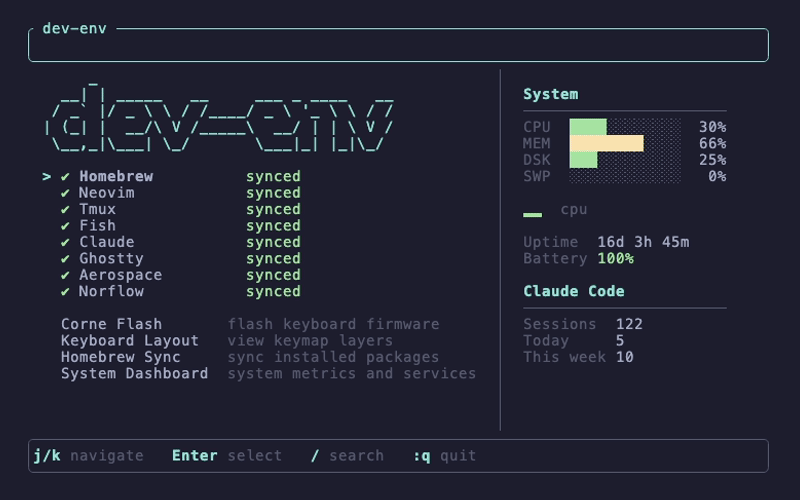

# Mac OS Dev Setup



## Quick Start

```bash
./os
```

## What It Does

The `./os` TUI manages the full dev environment setup:

- Installs Homebrew packages
- Symlinks all configs (Neovim, Tmux, Fish, Claude, Ghostty, Aerospace)
- Shows sync status for each tool
- Flashes Corne keyboard firmware
- Interactive keyboard layout viewer

## Keyboard Layout


## Structure

```
dev-env/
├── os                            # TUI launcher (builds + runs Rust binary)
├── src/                          # Rust source for the os TUI (ratatui)
├── Cargo.toml
├── homebrew/
│   ├── install.sh                # Installs missing formulae and casks
│   └── sync.sh                   # Syncs installed packages back to install.sh
├── neovim/
│   ├── init.lua
│   ├── lua/
│   └── snippets/
├── tmux/
│   ├── .tmux.conf
│   └── tmux-cd.sh
├── fish/
│   ├── config.fish
│   ├── fish_plugins
│   ├── fish_variables
│   └── functions/
├── ghostty/
│   └── config
├── aerospace/
│   └── aerospace.toml            # Aerospace window manager config
├── zsh/
│   └── .zprofile
├── claude/
│   └── CLAUDE.md
├── config/                       # ZMK Corne config (must live at repo root)
│   ├── boards/                   # Custom board/shield definitions
│   ├── corne.keymap
│   ├── corne.conf
│   └── west.yml
├── keyboard/
│   ├── README.md                 # Corne firmware + keymap docs
│   ├── build.yaml                # ZMK build matrix
│   ├── corne-flash/              # Rust flash utility
│   ├── draw.sh                   # Regenerates keymap.svg
│   ├── keymap-drawer.config.yaml
│   ├── keymap.svg
│   └── old/                      # Archived Voyager/QMK source
├── hooks/
│   └── pre-commit                # Regenerates keymap SVG + TUI screenshot
└── docs/                         # Per-tool documentation
```

See [docs/](./docs/index.md) for per-tool guides and [keyboard/README.md](./keyboard/README.md) for the Corne firmware.

## Homebrew Packages

**Formulae:** fish, fisher, fzf, go, lazygit, neovim, nvm, pnpm, ripgrep, tmux, zoxide, biome, duckdb, fd, fnm, gh, lua-language-server, tailwindcss-language-server, tree, uv, xh, postgresql@16, prettierd, wget, xcodegen, ffmpeg, git-filter-repo, lftp, libpq, poppler

**Casks:** claude-code, aerospace

Source of truth: [homebrew/install.sh](./homebrew/install.sh).

## Post-Install

- `fisher update` to install fish plugins
- `fnm install <version>` to install Node.js
- `chsh -s /opt/homebrew/bin/fish` to set fish as default shell

## Manual Setup

- [Aerospace](https://github.com/nikitabobko/AeroSpace) window manager
- [Homerow](https://www.homerow.app) (bind search to cmd+shift+/)
