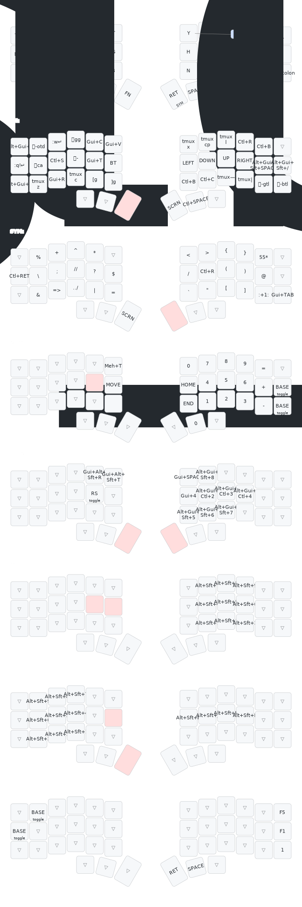

# Keyboard

ZMK firmware for a Corne (42-key split) running on `nice_nano_v2` controllers with `nice_view` displays.

The authoritative keymap lives at [`config/corne.keymap`](../config/corne.keymap) at the repo root (ZMK's reusable build workflow requires `config/` there). The build matrix lives at [`build.yaml`](build.yaml). Firmware is built by the [Build Corne firmware](../.github/workflows/build-corne.yml) GitHub Action on pushes to `config/**` or `keyboard/build.yaml`.

## Layout



## Regenerating the layout image

```bash
./keyboard/draw.sh
```

Requires `uvx` (from [uv](https://github.com/astral-sh/uv)). Uses [keymap-drawer](https://github.com/caksoylar/keymap-drawer) to parse `config/corne.keymap` and render `keyboard/keymap.svg`. Macro labels are mapped in `keymap-drawer.config.yaml`.

## Live layer viewer (ZMK Studio)

The firmware is built with `CONFIG_ZMK_STUDIO=y` (see `config/corne.conf`), which lets you connect to the keyboard over USB or Bluetooth and view the active layer in real time, or edit bindings without reflashing.

1. Flash the latest firmware (GH Action → artifacts → drag each half onto the `NICENANO` mount).
2. Open [zmk.studio](https://zmk.studio) in a Chromium browser (Chrome, Edge, Arc).
3. Click **Connect** → pick the Corne.

`CONFIG_ZMK_STUDIO_LOCKING=n` is set so Studio connects without an unlock binding. If you later want the keyboard locked until you press a dedicated key, flip that to `y` and bind `&studio_unlock` somewhere.

## Folders

- `old/` — archived ZSA Voyager QMK source and firmware binary.

## TODO: custom nice!view art (right half)

Goal: show a Spirited Away still on the right (peripheral) nice!view instead of the default ZMK logo. Display is 160×68 1-bit transflective, so the widget is drawn as a 68×140 image rotated 90°. High-contrast silhouettes (No-Face, Haku-as-dragon, bathhouse exterior) dither far better than photographic stills.

**Reference implementation:** [`YousefHadder/corne-zmk`](https://github.com/YousefHadder/corne-zmk) — Corne-specific shield with a Python image pipeline. Drop an image into `assets/`, a script converts it to an LVGL `LV_IMG_CF_INDEXED_1BIT` C array, and the peripheral widget renders it via `lv_animimg`.

**Plan:**

1. Add `zephyr/module.yml` at repo root (required — ZMK's `build-user-config@v0.3.0` workflow checks for it at the checkout root and sets `ZMK_EXTRA_MODULES=$GITHUB_WORKSPACE` when present). Set `board_root: keyboard` so everything else stays under `keyboard/`.
2. Port `boards/shields/nice_view_custom/` (12 files: `CMakeLists.txt`, `Kconfig.shield`, `Kconfig.defconfig`, `custom_status_screen.c`, `nice_view_custom.{conf,overlay,zmk.yml}`, `widgets/{peripheral_status.{c,h},status.{c,h},util.{c,h},bolt.c,art.c}`) into `keyboard/boards/shields/nice_view_custom/`. The shield's `CMakeLists.txt` only compiles `status.c` for the central role, so the left half is unaffected — we leave it on plain `nice_view`.
3. Port `scripts/niceview_lvgl_convert.py` (Pillow-based) into `keyboard/scripts/`. Run with `uv run --with Pillow` since system Python is PEP-668-locked.
4. Modify `widgets/peripheral_status.c`: replace the `LV_IMG_DECLARE(palestine)` + `anim_imgs[]` block so it references whatever image we drop into `assets/`.
5. Update `keyboard/build.yaml` right-half line to `shield: corne_right nice_view_adapter nice_view_custom`.
6. Extend `.github/workflows/build-corne.yml` path filters to include `keyboard/**` and `zephyr/**`.
7. Drop a Spirited Away source PNG into `keyboard/assets/`, run the conversion script to regenerate `widgets/art.c`, commit both, flash.

**Deferred decisions:** which frame/character to use, and whether to animate between multiple images (the `lv_animimg_set_duration` in `peripheral_status.c` supports a rotating gallery — YousefHadder rotates every 30s).
